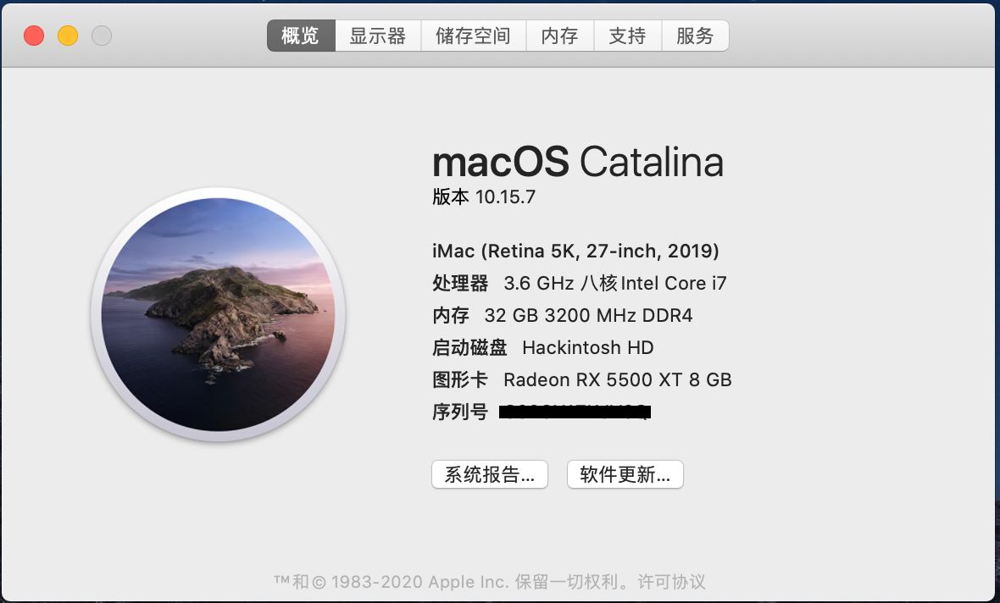
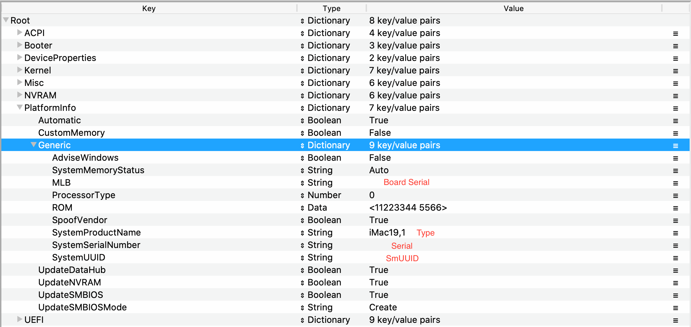

# hackintosh OpenCore 0.64 技嘉z390-auros-pro-wifi + i7 9700k




## 主要硬件

- cpu： i7 9700k 
- 主板： 技嘉z390-auros-pro-wifi
- 显卡： AMD蓝宝石 RX 5500 XT
- 内存： 3200HZ 16*2
- 硬盘：三星 970EVO plus 500G


**说说硬件**

技嘉z390-auros-pro-wifi主板不太好的一点，就是自带的无线网卡是CNVI接口的，不是原生免驱。现在有补丁，蓝牙wifi都可以用(不太好用)，隔空投送之类的用不了，有可能补丁完善了就可以用了。还有另一个方案是直接使用转换线，装一个免驱网卡，这样就完美了


需要其他硬件选择的详细说明，可参考 [Buyer's Guide](https://www.tonymacx86.com/buyersguide/building-a-customac-hackintosh-the-ultimate-buyers-guide/)

## 该引导使用步骤

### 一、制作启动盘

这个 可以参考官方版本：[制作启动盘](https://dortania.github.io/OpenCore-Install-Guide/installer-guide/)


### 二、修改引导文件（下文提到的EFI都是指从仓库下载下来的EFI）

1. **下载EFI**

2. **替换SMBIOS**
	
	- 使用 `GenSMBIOS` 工具生成三码，类似下面
	
      ```
       #######################################################
       #               iMac19,1 SMBIOS Info                  #
      #######################################################
      
      Type:         iMac19,1
      Serial:       C02XG0FDH7JY
	   Board Serial: C02839303QXH69FJA
	   SmUUID:       DBB364D6-44B2-4A02-B922-AB4396F16DA8
	   ```
	
	  
	
	- 使用 `ProperTree` 工具，打开 `EFI/OC/config.plist` ,用生成的三码替换，保存
	  
	  
	  
	  
	  
	  > 关于 `SMBIOS` 生成和替换我说的不够清楚可以参考详细说明 [PlatformInfo](https://dortania.github.io/OpenCore-Install-Guide/config.plist/coffee-lake.html#platforminfo)
	
	
	
	- 最后删除USB启动盘中的EFI，用修改好的EFI替换
	
3. **设置BOIS**

   版本F12
   
   
   
   - **禁用:**
   
   |                 英文                 |                           中文                           |
   | :----------------------------------: | :------------------------------------------------------: |
   |              Fast Boot               |                         快速启动                         |
   | CFG Lock (MSR 0xE2 write protection) |                CFG 锁 (MSR 0xE2 写入保护)                |
   |                 VT-d                 | [VT-d](https://zhidao.baidu.com/question/495526512.html) |
   |                 CSM                  |                      兼容性支持模块                      |
   |              Intel SGX               |                        Intel SGX                         |
   
   ------
   
   - **启用:**
   
   |          英文           |                           中文                           |
   | :---------------------: | :------------------------------------------------------: |
   |          VT-x           | [VT-x](https://zhidao.baidu.com/question/495526512.html) |
   |    Above 4G decoding    |                   大于 4G 地址空间解码                   |
   |     Hyper Threading     |                       处理器超线程                       |
   |   Execute Disable Bit   |                        执行禁止位                        |
   |   EHCI/XHCI Hand-off    |                   接手 EHCI/XHCI 控制                    |
   | OS type: Windows 8.1/10 |               操作系统类型: Windows 8.1/10               |
   |    Legacy RTC Device    |                      传统 RTC 设备                       |
   
   > 
   
   