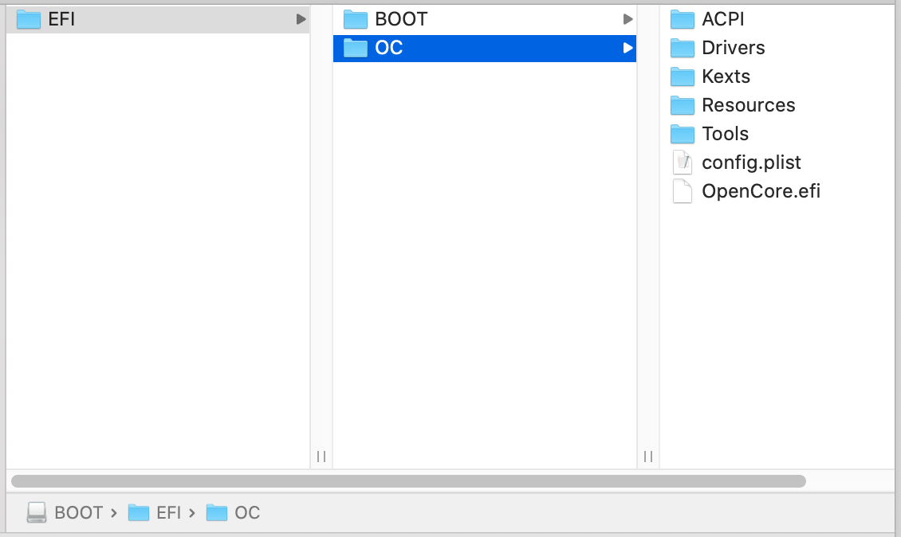
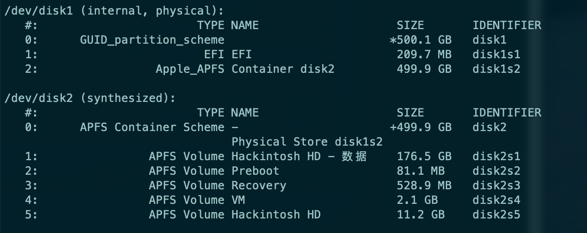

# hackintosh OpenCore 技嘉z390-auros-pro-wifi + i7 9700k


## 主要硬件


- cpu： i7 9700k 
- 主板： 技嘉z390-auros-pro-wifi
- 显卡： AMD蓝宝石 RX 5500 XT
- 硬盘：三星 970EVO plus 500G

  

**说说硬件**

技嘉z390-auros-pro-wifi主板不太好的一点，就是自带的无线网卡是CNVI接口的，不是原生免驱。现在有补丁，蓝牙wifi都可以用(不太好用)，隔空投送之类的用不了，有可能补丁完善了就可以用了。还有另一个方案是直接使用转换线，装一个免驱网卡，这样就完美了


需要其他硬件选择的详细说明，可参考 [Buyer's Guide](https://www.tonymacx86.com/buyersguide/building-a-customac-hackintosh-the-ultimate-buyers-guide/)

## 该引导使用步骤

### 一、制作启动盘

这个 可以参考官方版本：[制作启动盘](https://dortania.github.io/OpenCore-Install-Guide/installer-guide/)


-------------


### 二、修改引导文件

#### **1. 下载EFI**

#### **2. 替换 `SMBIOS`**

- 使用 `GenSMBIOS` 工具生成三码，类似下面

   ```
    #######################################################
    #               iMac19,1 SMBIOS Info                  #
   #######################################################
   
   Type:         iMac19,1
   Serial:       C02XG0FDH7JY
   Board Serial: C02839303QXH69FJA
   SmUUID:       DBB364D6-44B2-4A02-B922-AB4396F16DA8
   ```

  

- 使用 `ProperTree` 工具，打开 `EFI/OC/config.plist` ,用生成的三码替换，保存
  
  
  
  
  
  > 关于 `SMBIOS` 生成和替换我说的不够清楚可以参考详细说明 [PlatformInfo](https://dortania.github.io/OpenCore-Install-Guide/config.plist/coffee-lake.html#platforminfo)


- 最后删除USB启动盘中的EFI，用修改好的EFI替换
  


------------

### 三、设置BOIS

**BOIS 版本F12j** 

- Tweaker
  - Advanced CPU Settings
    - VT-d 	->  `Disabled`
  
- Settings
  - Platform Power
    - ErP	-> `Disabled`
  - IO Ports
    - Internal Graphics	-> `Enabled`
    - DVMT Pre-Allocated  -> `64M`
    - DVMT Total Gfx Mem -> `256M`
    - Above 4G Decoding -> `Enabled`
    - USB Configuration 
      - XHCI Hand-off	-> `Enabled`
    - NetWork Stack Configuration
      - Network Stack	-> `Disabled`
  
- System Info

- Boot
  - CFG Lock -> `Disabled`
  - Fast Boot  -> `Disabled`
  - Windows 8/10 Features -> `Windows 8/10`
  - CSM Support -> `Disabled`
  
- Save & Exit
  
  - save & Exit Setup (最后一步保存退出，重启)
  
  
  
  ------------------
  
  
  
  Bois版本不一样，有些设置所在的位置不一样。CFG Lock 我在F11版本中没找到。
  
  如果找不到CFG Lock ，OpenCore设置文件中也可以关闭 `Kernel -> Quirks -> AppleCpuPmCfgLock & AppleXcpmCfgLock` 这两项全设为 `true`
  
  

---------

### 四、BIOS设置u盘启动，开始引导安装


------

### 五、 无u盘启动

现在已经成功进入系统，但是需要依靠u盘才能进入系统，所以下一步我们要进一步完善，可以不依赖u盘启动

1. 进入macOS系统，打开终端，输入命令`diskutil list`, 结果大概如下
   

   

2. 挂载EFI分区，`sudo diskutil mount /dev/disk1s1`

   我的挂载是在`/dev/disk1` 下面的  `1` 号磁盘，所以是 `/dev/disk1s1` , 挂载情况有可能不一样，替换相应的命令

   输入系统密码， 在磁盘列表就可以看见`EFI` 隐藏分区已经被挂载
   

3. 用USB启动盘中的 `EFI` 替换macOS系统中的 `EFI`
   

## 功能情况

这里只列出了部分经过我测试的，没列出来的就是暂时没发现问题的，后续使用发现问题也会进行修复更新。当然，非常欢迎使用这套引导的朋友，提出你们使用过程中发现的问题

### 调整好的功能

- 声卡驱动：之前声卡注入有点问题，会有破音，声音不稳定等情况。经过调整，可以完美驱动
- 核心显卡：经过调整，完美驱动，剪辑4k视频无压力


### 待完善

- Wi-Fi和蓝牙不算太完美，隔空投送无法使用，等待 `AirportItlwm.kext` 的完善，当然这方面有需求的可以直接上免驱网卡

  

## 配置OpenCore参考资料

[OpenCore中文精解](https://blog.daliansky.net/OpenCore-BootLoader.html) ，想让引导行为更像白果，可以参考里面的 `Boot` 引导界面的设置

[OpenCore-Install-Guide](https://github.com/dortania/OpenCore-Install-Guide)，找到对应的0.64版本的中的README


## 写在最后

对于国内用户，下载太慢，可以去码云 [OpenCore z390-auros-pro-wifi](https://gitee.com/micah-yu/open-core-hackintosh-gigabyte-z390-auros-pro-wifi-i7-9700k) 


